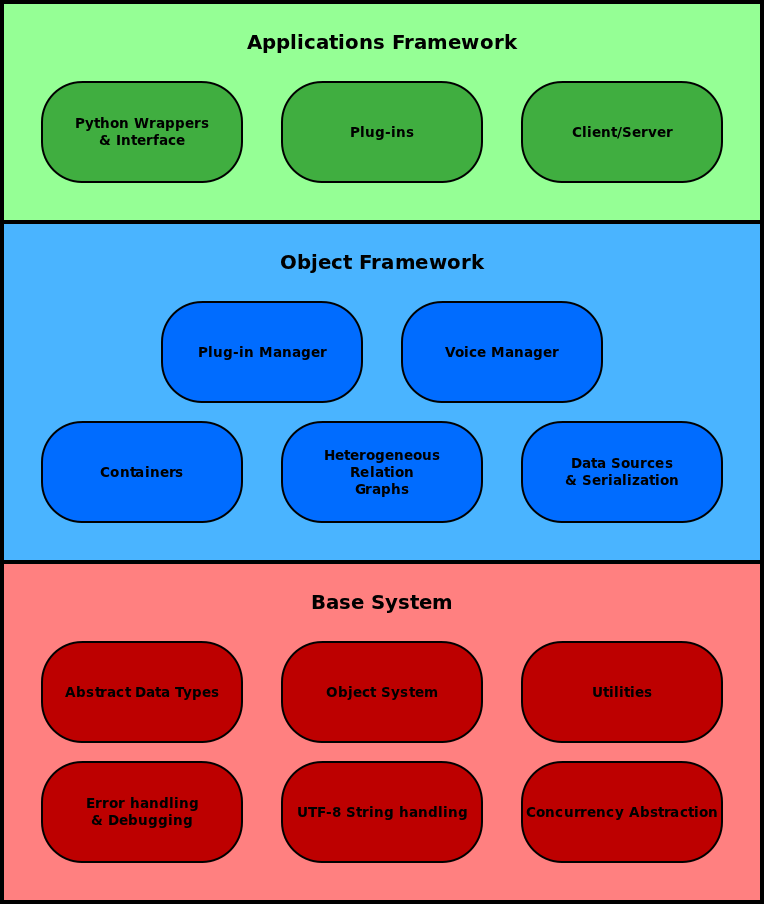

.. _architecture_topic:

.. index:: 
   single: Topic Guides; System Architecture

.. index:: ! System Architecture

===================
System Architecture
===================

The system architecture can be divided into two distinct
parts, namely the *engine* and *plug-ins*.

|

.. _figure_arch:

   Figure 3: Speect Engine architecture.

|

.. index::
   single: System Architecture; Engine

.. _system_arch_engine:

.. rubric:: Engine

The engine is completely independent of any language or waveform
generation modules, and is solely responsible for the loading of
voices and their associated data and plug-ins, and controlling the
synthesis process. The engine is not dependent on any external
libraries, and provides lower level functionality to the plug-ins.
The engine consists of the base system and the object framework (see
:ref:`figure 3 <figure_arch>`). The base system provides a low
level library to the following modules:

      * abstract data types (lists, buffers, hash tables),
      * utilities (memory allocation, byte-swapping, timing,
        fundamental types, versioning, math and system path
        functions),
      * error handling, debugging and logging,
      * platform independent concurrency abstraction,
      * UTF-8 string handling (character and string level functions,
        printing functions and regular expressions),
      * and an object system.

The object system allows an object-oriented programming approach to
the higher level libraries implemented in the object framework. These
higher level libraries provide the following modules:

	* containers (map, list),
	* data sources and data serialization,
	* heterogeneous relation graphs (HRGs) (for internal utterance
          representation),
	* plug-in manager,
	* and a voice manager.

.. index::
   single: System Architecture; Plug-ins

.. rubric:: Plug-ins

The plug-ins provide:

    * new object types,
    * interfaces to voice data (linguistic and acoustic),
    * modules to do processing on utterance structure (utterance and
      feature processors), and
    * the scripting language interface.
