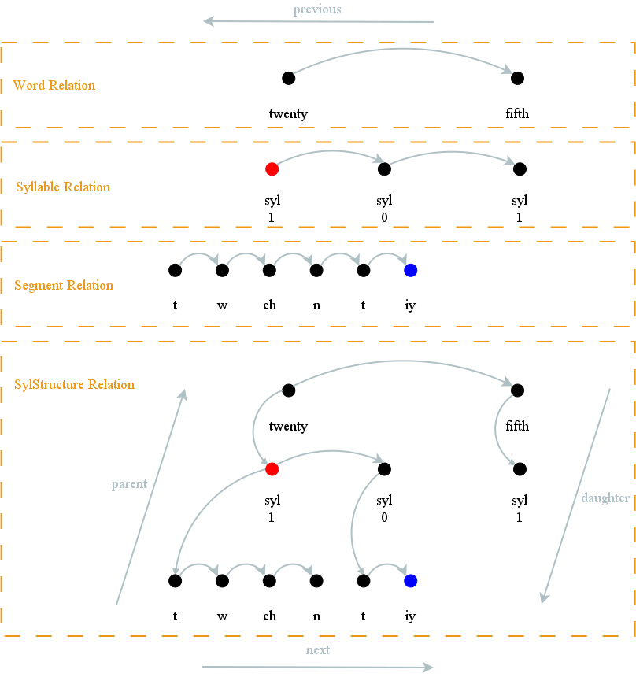

.. index:: 
   single: Topic Guides; Heterogeneous Relation Graphs

.. index:: Heterogeneous Relation Graphs

.. _hrg_topic:

=============================
Heterogeneous Relation Graphs
=============================

The utterance structure is represented internally as a *heterogeneous
relation graph* (HRG), which consists of a set of relations, where
each relation contains some items (the items need not be unique to a
relation). The relations represent structures such as words,
syllables, phonemes or even duration targets and the items are the
content of these structures.

:ref:`Figure 4 <figure_hrg>` shows an example representation of an
utterance structure, for the text input "twenty fifth", using a HRG
with four relations and their items. The relations are:

     * ``Word`` - where the items are the words in the utterance.
     * ``Syllable`` - the items are the syllables in the words.
     * ``Segment`` - the items represent phones in the words.
     * ``SylStruct`` - a relation that connects the ``Word``, ``Syllable`` and
       ``Segment`` relations.

Note that for brevity the phones of the word "fifth" have been
omitted. The figure also shows the item's features, for example, the
``Word`` relation's items have as a "name" feature the word it was
derived from, whereas the ``Syllable`` relation's items have a
"stress" feature (0 or 1). The number of features are conceptually
unlimited, the only restriction being that the feature names are unique
in a specific item.

|

.. _figure_hrg:

   Figure 4: An example representation of an utterance structure using a heterogeneous relation graph.

|

The following sections discuss abstract HRG functions that are implemented in Speect.

.. index:: 
   single: Heterogeneous Relation Graphs; Traversal

Traversal
=========

The traversal of the graph is done with four basic functions,
*previous*, *next*, *parent* and *daughter*:

.. rubric:: Previous and Next

In the ``Word``, ``Syllable`` and ``Segment`` relations we can see
that **all** items are connected, i.e. all items have a *previous* and
a *next* item (except of course the head and tail items), while this
is not the case for the ``SylStruct`` relation. The ``SylStruct``
relation's items have breaks in between certain items.

.. rubric:: Parent and Daughter

The ``SylStruct`` relation's items have *parent* and *daughter* nodes,
which the other three relations do not have. Each item has **one**
parent node, for example, the ``/eh/`` phone's parent is the first
``Syllable`` relation item. An item may have multiple daughter nodes,
the first word item ("twenty") has 2 daughter nodes, which in turn
have their own daughter nodes.

The *parent* function will traverse to the left to find the leftmost
connected item, and return it's parent item.

.. index:: 
   single: Heterogeneous Relation Graphs; Contents

Contents
========

Each item is a unique node in the graph, but items may share their
*contents* or features. In other words, although all items are unique,
conceptually items that share their contents can be viewed as the same
item. For example in :ref:`figure 4 <figure_hrg>`, one can see that
all the items in the ``Word`` relation share their contents with the
top level of items in the ``SylStruct`` relation.

This concept enables us to switch relations while traversing:

.. rubric:: *As* relation

Lets start traversing the ``Segment`` relation from left to
right. None of the item's have a *parent* item, but we can switch to
the ``SylStruct`` relation with the *as relation* function, from where
we can find parent items in the form of the ``syl`` items.

.. rubric:: *In* relation

While still traversing the ``Segment`` relation, we can query each
item if it shares it's content with an item in another relation (*in
relation*). While all the ``Segment`` relation items do share their
content with items in the ``SylStruct`` relation, none of them share
content with any items in the ``Word`` relation.

.. index:: 
   single: Heterogeneous Relation Graphs; Extending

Extending
=========

The HRG structure can be extended as follows:

.. rubric:: Append

Items can be appended to other items, or relations.

.. rubric:: Pre-pend

Items can be pre-pended to other items, or relations.

.. rubric:: Add daughter

Items can be added as daughter items of other items.

.. index:: 
   single: Heterogeneous Relation Graphs; Paths

.. _hrg_paths:

Paths
=====

HRG traversal can also be accomplished by item *paths*. Let's say for
argument's sake that we have as a starting point the last phone of a
word ("twenty") as it is in the ``Segment`` relation (``/iy/`` item).
Now we want to traverse to the first ``Syllable`` item of the next
word. We would have to call the following sequence of functions:

     * *as relation* ``SylStruct``
     * *parent*
     * *parent*
     * *next*
     * *daughter*
     * *as relation* ``Syllable``

The above sequence requires a lot of coding, which can be replaced
with item paths. Paths consists of period (".") separated tokens that
represent a traversal or content switch function. For example, the
following token string will execute exactly the same sequence of
functions::

	  R:SylStruct.parent.parent.n.daughter.R:Syllable

The possible tokens are:

=========   ========
Token       Meaning
=========   ========
p 	    previous item
n 	    next item
daughter    first daughter item
daughtern   last daughter item
parent 	    parent item
R:relname   item *as* it is in the given relation ``relname``
=========   ========

We can also extract a feature of the path item by adding a *feature
processor* name to the end of the path. Let's say for example that we
have a feature processor, named "syltone", that can calculate a
syllable item's tone. The path can then be::

	  R:SylStruct.parent.parent.n.daughter.R:Syllable.syltone
     
The same can also be done for any named feature of an item, for example::

	  R:SylStruct.parent.parent.n.name

will return "fifth", as that is the name of the second ``Word``
relation item in :ref:`figure 4 <figure_hrg>`.

Examples
========

Examples of the API usage of the HRG modules:

	 * :doc:`hrg_topic_c`

  
