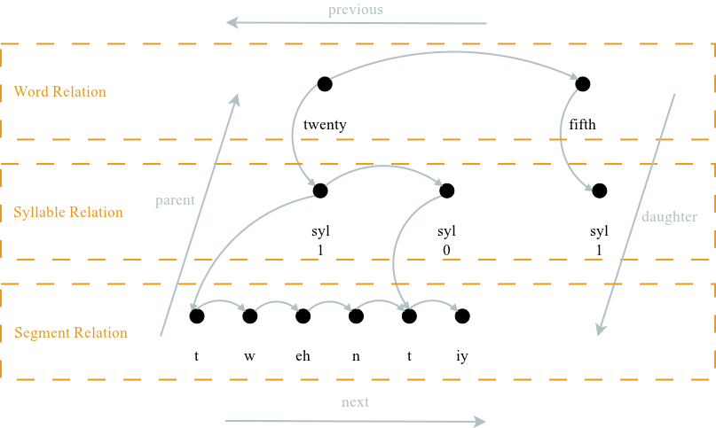

.. _hrg_topic/main:

.. index:: 
   single: Topic Guides (C API); Heterogeneous Relation Graphs

=============================
Heterogeneous Relation Graphs
=============================

The utterance structure (:c:type:`SUtterance`) is represented
internally as a Heterogeneous Relation Graph [#]_ (HRG), which
consists of a set of relations, where each relation contains some
items (the items need not be unique to a relation). The relations
represent structures such as words, syllables, phonemes or even
duration targets and the items are the content of these
structures. 

See :doc:`../api/c/engine/hrg/main` for a detailed description
of the API.

:ref:`Figure 1 <figure_hrg>` shows an example representation
of an utterance structure using a HRG with three relations and their
items.

|

.. _figure_hrg:

   Figure 1: An example representation of an utterance structure using a heterogeneous relation graph.

|

The code to recreate the HRG structure in :ref:`Figure 1 <figure_hrg>`
can be found at ``speect/engine/examples/hrg/create_docs_example.c``,
or :doc:`../examples/c/hrg_example`. Here we will show some snippets to
explain the process of building an utterance.

An utterance is created by a call to :c:macro:`S_NEW`, after which it must
be initialized with :c:func:`SUtteranceInit`. For example:

.. code-block:: c

   SUtterance *utt;
   
   
   utt = S_NEW(SUtterance, &error);
   SUtteranceInit(&utt, NULL, &error);

The :c:func:`SUtteranceInit` function takes the voice as an argument,
but in the above example we have used :c:type:`NULL`, which is fine if
one does not need the utterance's voice (:c:func:`SVoiceSynthUtt` is
used if one has a voice and wants to synthesize an utterance.)

A relation is created from the utterance with :c:func:`SUtteranceNewRelation`:

.. code-block:: c

   SRelation *wordRel;

   wordRel = SUtteranceNewRelation(utt, "Word", &error);

and items can be created by appending them to a relation with :c:func:`SRelationAppend`:

.. code-block:: c

   SItem *wordItem;

   wordItem = SRelationAppend(wordRel, NULL, &error);	
   SItemSetName(wordItem, "twenty", &error);

The :c:type:`NULL` argument passed in :c:func:`SRelationAppend` is for
an item's shared content (also used in :c:func:`SItemAppend`,
:c:func:`SItemPrepend`, :c:func:`SItemAddDaughter` and
:c:func:`SRelationPrepend`). Shared content is used when one wants to
add an item to more than one relation, and share the content of the
items. For example, we might have a token relation, with the first
token being "21". In the word relation we will have two words,
"twenty" and "one", both of which can be daughters (as in :ref:`Figure
1 <figure_hrg>`, but with the token relation one level higher than the
word relation) of the "21" token item. To create the shared items we
can code it as follows:

.. code-block:: c
   :linenos:

   SItem *item21;
   SItem *itemTwenty;
   SItem *itemOne;

   item21 = SRelationAppend(tokenRel, NULL, &error);	
   SItemSetName(item21, "21", &error);

   itemTwenty = SRelationAppend(wordRel, NULL, &error);	
   SItemSetName(itemTwenty, "twenty", &error);

   itemOne = SRelationAppend(wordRel, NULL, &error);	
   SItemSetName(itemOne, "one", &error);

   SItemAddDaughter(item21, itemTwenty, &error);
   SItemAddDaughter(item21, itemOne, &error);

:ref:`Figure 2 <figure_hrg_shared>` shows a representation of the HRG that
can be created by following the above code example. Note that ``item21`` is now
the parent item (gotten with :c:func:`SItemParent` of both ``itemTwenty`` and ``itemOne``).

|

.. _figure_hrg_shared:

.. figure:: ../../figures/hrg.shared.png
   :scale: 85%
   :alt: 
   :align: center

   Figure 2: An example of the HRG representation of parent/daughter items. 

|

.. [#] Taylor, P., Black, A.W., and Caley, R. “Heterogeneous relation graphs as a mechanism for representing linguistic information”, Speech Communication 33:153-174, 2001.
