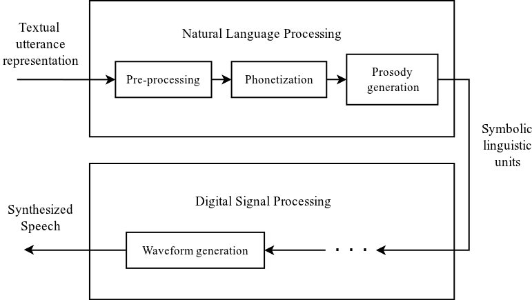
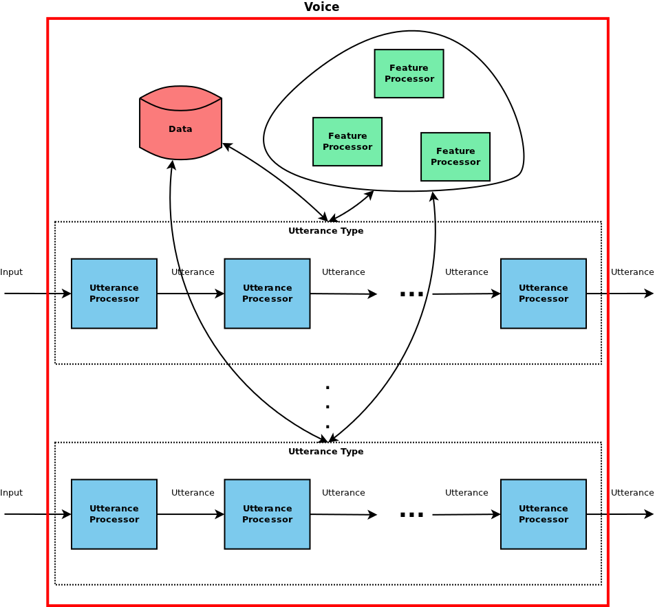

.. _introduction_topic:

.. index:: 
   single: Topic Guides; Introduction

============
Introduction
============

The Speect system can be divided into two distinct parts, the *engine*
and *plug-ins*. The Speect engine is completely independent of any
text-to-speech specific modules, and is solely responsible for the
loading of voices and their associated data and plug-ins, and
controlling the synthesis process. The plug-ins provide new object
types and interfaces to voice data (linguistic and acoustic), as well
as the processors that convert some form of textual input into a
waveform.

Speect is not meant to replace speech processing toolkits. The
linguistic and acoustic models and data still needs to be generated by
packages such as Edinburgh Speech Tools [#]_, Festvox [#]_, the Speech
Signal Processing Toolkit [#]_ and others.

For this introduction we give a very brief overview of the main
functional blocks of the text-to-speech process, and a high level
description of how these abstract functional blocks are implemented in
Speect.

.. index:: 
   single: Topic Guides; Text-to-speech

Text-to-speech
==============

Text-to-speech (TTS) synthesis is the automated process of mapping a
textual representation of an utterance into a sequence of numbers
representing the samples of synthesized speech [#]_.  This conversion is
achieved in two stages as depicted in :ref:`figure 1
<figure_tts_con>`:

     * Natural Language Processing (NLP): Converting the textual
       representation of an utterance into symbolic linguistic units.
     * Digital Signal Processing (DSP): Mapping the symbolic
       linguistic units into samples of synthesized speech.

|

.. _figure_tts_con:

   Figure 1: Functional blocks of a text-to-speech synthesizer.

|

The Natural Language Processing stage consists of the following major
modules:

	* Text pre-processing involves the transformation of the
	  textual input into a format suitable for the phonetization
	  module. The specifics of this task is dependent on the type
	  of textual input given to the system and includes utterance
	  chunking and text normalization.

	* The normalized text of the pre-processing module is
	  converted into a phonetic representation by the
	  phonetization block.

	* Prosody generation involves the generation of intonation and
	  duration targets through some form of prosody models.

The data generated by the NLP stage represents the symbolic linguistic
units, which are then converted into synthetic speech by the Digital
Signal Processing stage. The DSP stage can be realized by means of
unit selection [#]_, statistical parametric synthesis [#]_, formant
synthesis [#]_, or some other type of synthesizer technology. Each of
the modules in the two stages adds some type of information to the
initial given utterance which enables the final module, *waveform
generation*, to generate synthetic speech based on this information.
The NLP stage is language dependent, whereas the DSP stage is
dependent on the synthesizer technology of the implemented synthetic
voice.

How is it implemented?
======================

From the functional blocks or modules of the NLP and DSP stages of figure 1
we define the following objects and processes:

.. index:: 
   single: Topic Guides; Utterance 

.. rubric:: Utterance

The *utterance* is the input and output of all the functional blocks
shown in :ref:`figure 1 <figure_tts_con>`, even for the DSP processors
which generate the speech signal. Speect models the utterance
internally as a :doc:`heterogeneous relation graph <hrg_topic>` [#]_,
and all the modules of figure 1 just add information to the utterance.

.. index:: 
   single: Topic Guides; Utterance Processor

.. rubric:: Utterance Processor

In Speect the function blocks depicted in :ref:`figure 1
<figure_tts_con>`, which do some or other conversion to their
respective inputs, are known as *utterance processors*. An utterance
processor receives an utterance as input and transforms the utterance
in some or other way based on knowledge of the:

	  * input type: an email message, for example, requires some
	    extra processing when compare to a single line of text,
	  * language: phonetization will for example be different for
	    English, when compared to isiZulu, and the
	  * voice: different voices will have different
            speaking rates, pitch contours and so on.

.. index:: 
   single: Topic Guides; Utterance Type

.. rubric:: Utterance Type

From :ref:`figure 1 <figure_tts_con>`, we can see that there is a
pipeline of utterance processors doing transformations on the
utterance, and producing the synthetic speech. We call this collection
of utterance processors an *utterance type*.

Utterance types can be defined for any input types, languages or
synthesizer technologies, by just having a different pipeline of
utterance processors.

.. index:: 
   single: Topic Guides; Feature Processors

.. rubric:: Feature Processors

Utterance processors also make use of *feature processors*. A feature
processor extracts features from individual units in an
utterance. Feature processors are defined in a key-value (name -
processor implementation) mapping, and are called by their names. The
real power of feature processors becomes apparent when doing
multilingual TTS, for example, we can reuse utterance processors and
just redefine the key-value pair of a feature processor (same name,
different implementation).

.. index:: 
   single: Topic Guides; Voice

Putting everything together: a Voice
====================================

All of this comes together in the definition of a *voice*.  In Speect,
a voice defines the utterance types that can be used for synthesis
with the specific voice. Each of these utterance types defines a
pipeline of utterance processors. The voice also defines the feature
processors key-value mapping, connecting a named feature processor to
a specific implementation, which the utterance processors then can
use. Finally, the voice defines it’s data, be that linguistic
(phonesets, grapheme to phoneme rules, ...) or acoustic (unit
inventory, acoustic models, ...). :ref:`Figure 2 <figure_voice>` shows
a representation of this voice definition.

|

.. _figure_voice:

   Figure 2: Speect voice definition.

|

References
==========

.. [#] The Centre for Speech Technology Research, The University of Edinburgh, The Edinburgh Speech Tools Library, http://www.cstr.ed.ac.uk/projects/speech_tools/.

.. [#] Black, A. and Lenzo, K. “Building Voices in the Festival Speech Synthesis System”, http://www.festvox.org/festvox/bsv.ps.gz, 2003.

.. [#] Department of Computer Science, Nagoya Institute of Technology, Speech Signal Processing Toolkit, http://sp-tk.sourceforge.net/.

.. [#] Stylianou, Y., “Harmonic plus noise models for speech,combined with statistical methods, for speech and speaker modification”, Ph.D. Thesis, Ecole Nationale Superieuredes Telecommunications, Paris, France, 1996.

.. [#] Hunt, A. and Black, A. “Unit selection in a concatenative speech synthesis system using a large speech database”, In Proceedings of ICASSP, vol 1, pp. 373-376, Atlanta, Georgia, 1996.

.. [#] Black, A., Zen, H., and Tokuda, K. “Statistical Parametric Synthesis”, Proceedings of ICASSP, Hawaii, 2007.

.. [#] Högberg, J. “Data driven formant synthesis”, In Proceedings of Eurospeech, pp. 565-568, Greece, 1997.

.. [#] Taylor, P., Black, A.W., and Caley, R. “Heterogeneous relation graphs as a mechanism for representing linguistic information”, Speech Communication 33:153-174, 2001.
